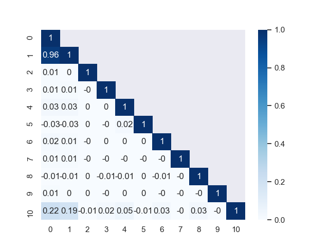

## 项目报告

11930639 张晓文

### 一、数据预处理

#### 1.1 数据描述

train.data 中 class 1 有117个，class -1 有 1955个


`train.data` 每列最值 

```shell
# min
0    -1.0
1    -1.0
2    -1.0
3    -1.0
4    -1.0
5    -1.0
6    -1.0
7    -1.0
8    -1.0
9    -1.0
10   -1.0
dtype: float64

# max
0     0.97803
1     1.00000
2     1.00000
3     0.90172
4     1.96310
5    -0.93067
6    -0.18695
7     0.25000
8    -0.56799
9     1.14290
10    1.00000
dtype: float64
```

`test.data`  最值

```shell
# min
0    -0.80899
1    -0.97776
2    -1.00000
3    -1.00000
4    -1.00000
5    -1.00000
6    -1.00000
7    -1.00000
8    -1.00000
9    -1.00000
10   -1.00000
dtype: float64

# max
0     1.000000
1     1.000000
2    -0.250000
3    -0.066779
4     3.444400
5    -0.899200
6    -0.595630
7    -0.655000
8     0.627390
9    -0.571430
10    1.000000
dtype: float64
```

由于 `train.data` 和`test.data `中，每一列的最值范 围

#### 1.2 特征相关性分析

[concepts](https://blog.csdn.net/qq_36874480/article/details/80272047)

[pandas 库](https://blog.csdn.net/ChenVast/article/details/82802009)



#### 1.3 SMOTE 重复采样

解决分布不均


```python
clf = svm.SVC(kernel='linear', class_weight='balanced')
```

output

>   ​					precision    recall  f1-score   support
>
>   ​         -1.0       0.95      	0.71      0.81       388
>
>   ​         1.0       0.10     	 0.48      0.17        27
>
>   accuracy                           			0.69       415   
>
>   macro avg       	0.53      0.59      0.49       415
>
>    weighted avg     0.90      0.69      0.77       415

```python
clf = svm.SVC(kernel='linear')
```

>   ​			precision    recall  f1-score   support        
>
>    -1.0       0.94      1.00      0.97       391         
>
>   1.0       0.00      0.00      0.00        24     
>
>   accuracy                           			0.94       415   
>
>   macro avg      	 0.47      0.50      0.49       415
>
>    weighted avg       0.89      0.94      0.91       415

```python
smote = SMOTE(sampling_strategy=0.5, random_state=100) # ratio为0.5的时候，总体效果还算比较好
```

>   Counter({-1.0: 1557, 1.0: 762})
>
>   ​              precision    recall  f1-score   support
>
>   ​         -1.0       0.97      0.93      0.95       398
>
>   ​         1.0       0.20      0.41      0.27        17
>
>   ​     accuracy                           0.91       415
>
>      macro avg       0.59      0.67      0.61       415
>
>    weighted avg       0.94      0.91      0.92       415

### 二、分类模型

#### 2.1 逻辑回归

#### 2.2 支持向量机

#### 2.3 最近邻方法

#### 2.4 随机森林

#### 2.5 Boosting 类

[Gradient Boosting 调参](https://www.cnblogs.com/pinard/p/6143927.html)

[LGBM](https://zhuanlan.zhihu.com/p/76206257)

### 实验及结果

#### 3.1 评价标准

-   准确率 (Accuracy) 是分类正确的样本占总样本个数的比例 $Accuracy = \frac{n_correct}{n_total}$

    当不同类别样本的比例非常不均衡时，占比大的类别往往成为影响准确率的最主要因素

-   精确率 (precision) 直观地可以说是分类器不将负样本标记为正样本的能力 $precision = \frac{TP}{TP+FP}$

    Precision越高，模型对负样本的区分能力越强

-   召回率 (recall) 指实际为正的样本中被预测为正的样本所占实际为正的样本的比例

    Recall越高，模型对正样本的识别能力越强

-   F1 score是精确率和召回率的调和平均值 $F1=\frac{2 \cdot precision \cdot recall}{precision + recall}$

    最好值为1，最差值为0. 精确率和召回率对F1 score的相对贡献是相等的.

    F1 score越高，说明模型越稳健

#### 3.2 实验结果

##### 3.2.1 逻辑回归

##### 3.2.2 支持向量机

##### 3.2.3 最近邻方法

##### 3.2.4 随机森林

#### 3.3 模型效果对比

